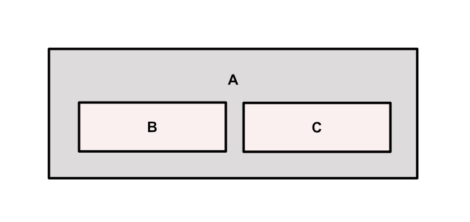
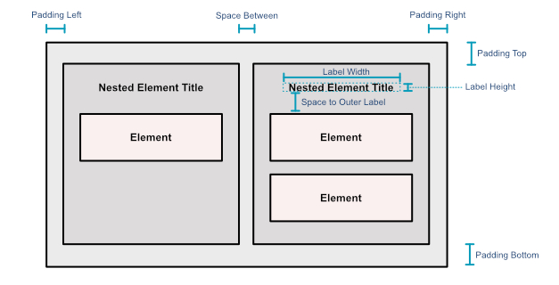

# Smart View

Advanced automatic layout generator for better graph visualization.

## Getting Started

This lib allows you to easily generate diagrams from a graph description. You can choose from different 
auto-layout styles, such as Nested and Hierarchy layouts.

### Nested Layout

Organizes elements in a top view approach, nesting children inside parents. Best suitable
for tree visualization.


### Hierarchy Layout

Organizes elements in a side view approach, positioning children below parents and respecting 
parents' horizontal boundaries. Best suitable for tree visualization.


### Graph Input

You can pass relationship paths that describe your graph as input to generate advanced views. A relationship path
can be represented as an array of elements, where the most left (first) element is considered the
main element. For example, the following elements form a relationship chain with the main element:

```
(Customer)->(Product)<-(Supplier)
```

The situation presented could be translated as:

```
[Customer, Product, Supplier]
```

For proper rendering, additional information is required when describing
an element in the relationship chain. Elements must be described as follows:

```
{
    identifier: string; // Optional - Represents the element id
    name: string;
    type: string;
}
```

### Generating a View from Paths

Firstly, you must define the paths (graph) to be processed; in this case, a simple example is provided:

```
const paths = [
  [
    {
      "identifier": "2cdb720a",
      "name": "A",
      "type": "businessactor"
    },
    {
      "identifier": "46f5e647",
      "name": "B",
      "type": "businessprocess"
    }
  ],
  [
    {
      "identifier": "2cdb720a",
      "name": "A",
      "type": "businessactor"
    },
    {
      "identifier": "46f5e646",
      "name": "C",
      "type": "businessprocess"
    }
  ]
];
```

Then, create and set up the engine by passing a Settings object.

```
const layoutSettings = new Settings({
    layoutType: "nested", // The chosen layout type is indicated here
    spaceBetween: 2,
    spaceToOuterLabel: 2
});
  
let smartView = new SmartViewEngine(layoutSettings);
```

Finally, generate a View description from your paths.

```
const view = smartView.generateView(paths, "View Name");
```

The result is a View description containing View Nodes and Relationships with
proper Width, Height and Position to be drawn using a drawing tool from your
preference.

The following image shows a sample output rendering for the paths provided in the example mentioned above.



> You can use [archimate-diagram-engine](https://www.npmjs.com/package/@arktect-co/archimate-diagram-engine) to
> render Archimate views using JointJS

### Output

The generated diagram is returned as a View, which is an object containing mainly the View Nodes
and View Relationships. From this object, you can render your diagram using a drawing tool of
your choice.

A View is structured as follows:

```
{
  id: string;
  viewRelationships: [
      {
          name: string;
          type: string;
          parentId: string | null;
          modelNodeId: string;
          viewNodeId: string;
      }
  ];
  viewNodes: [
      {
          modelRelationshipId: string;
          sourceId: string;
          targetId: string;
          viewRelationshipId: string;
          type: string;
          bendpoints: [{ x: number; y: number }];
      }
  ];
  name: string;
  bounds: {
    horizontal: { min: number; max: number };
    vertical: { min: number; max: number };
  };
}
```

### Settings

You can control how the View will be generated by adjusting Settings parameters.

- **layoutType** [LayoutTypes]: 
- **maxHorizontalCount** [number]: How many elements are allowed on the same row at level 0 (root level)
- **maxChildHorizontalCount** [number]: How many elements are allowed on the same row within the parent scope
- **spaceBetween** [number]: Points between elements
- **spaceToOuterLabel** [number]: Points between the first element and the label area
- **sizeUnit** [number]: Small size unit to be used to build elements. An ordinary element has 3 Size Units (Width) x 1 Size Unit (Height)
- **leftPadding** [number]: Padding between nested elements and the parent's left border
- **rightPadding** [number]: Padding between nested elements and the parent's right border
- **topPadding** [number]: Padding between nested elements and the parent's top border
- **bottomPadding** [number]: Padding between nested elements and the parent's bottom border
- **labelWidth** [number]: Label area width
- **labelHeight** [number]: Label area height
- **lateralLabel** [boolean]: Indicates that the label area must be placed sideways

The image below illustrates how the Settings parameters affect the generated visualization.

